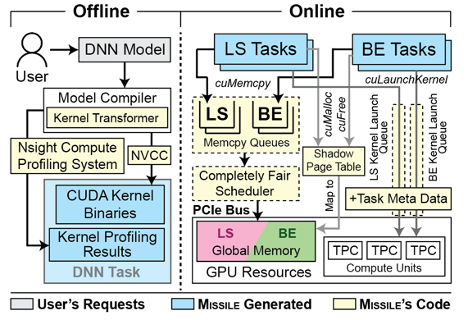

### 🚀 Missile: Fine-Grained, Hardware-Level GPU Resource Isolation for Multi-Tenant DNN Inference

*This project is protected under GPL License.*
*Unauthorized copies for commercial use or distribution are PROHIBITED.*

#### 🗂️ Table of Contents

- [🚀 Missile: Fine-Grained, Hardware-Level GPU Resource Isolation for Multi-Tenant DNN Inference](#-missile-fine-grained-hardware-level-gpu-resource-isolation-for-multi-tenant-dnn-inference)
  - [🗂️ Table of Contents](#️-table-of-contents)
  - [🏠 Overview](#-overview)
  - [🏛️ Missile's Architecture](#️-missiles-architecture)
    - [System Components](#system-components)
    - [GPU Sharing Policies](#gpu-sharing-policies)
  - [🖥️ System Requirements](#️-system-requirements)
    - [Hardware Requirements](#hardware-requirements)
    - [Software Prerequisites](#software-prerequisites)
  - [✈️ Quick Start](#️-quick-start)
    - [Step 1. Build Missile](#step-1-build-missile)
    - [Step 2. Update NVIDIA's GPU Driver](#step-2-update-nvidias-gpu-driver)
    - [Step 3. Download DNN Models](#step-3-download-dnn-models)
    - [Step 4. Launch Missile's Server](#step-4-launch-missiles-server)
    - [Step 5. Launch Missile's Client](#step-5-launch-missiles-client)
  - [💡 Miscellaneous](#-miscellaneous)


#### 🏠 Overview

Missile is a fine-grained, hardware-level GPU resource isolation solution for multi-tenant DNN inference. Missile supports elastic GPU compute unit partitioning, VRAM channel isolation, and weighted PCIe bus scheduling.

#### 🏛️ Missile's Architecture

##### System Components



##### GPU Sharing Policies

Currently, Missile supports the following GPU sharing schemes:

1. `missiletemporal`: Missile's GPU sharing solution, including elastic SM multiplexing, VRAM channel isolation, and PCIe Completely Fair Scheduling.
2. `orion`: Orion's interference-aware GPU sharing solution, which disallow memory- or compute-bound BE kernels to contend for resources with memory- or compute-bound LS kernels.
3. `mpsplus`: The MPS+ baseline in the paper. This scheme needs the GPU to support NVIDIA MPS feature.
4. `temporal`: Temporal multiplexing, which only executes one DNN kernel each time.

#### 🖥️ System Requirements

##### Hardware Requirements

**Supported GPUs**


|  | Tesla P40 | Tesla V100 | RTX A2000 (RTX 3060) | RTX A5500 (RTX 3090) |
| --- | --- | --- | --- | --- |
| Architecture | Pascal | Volta | Ampere | Ampere |
| # VRAM Channels | 12 | 32 | 6 | 12 |

**Recommended requirements of host machine**

CPU: 36 Physical Cores (or more)
Memory: 32 GiB (or larger)

**Testbeds for reproducing the paper's results**

**Note:** RTX A2000 and RTX A5500 can be replaced by RTX 3060 and RTX 3090 to reproduce the results in Scenario #1, because RTX A2000 and RTX 3060 share the same GPU core (GA106), and RTX A5500 and RTX 3090 share the same GPU core (GA102).

| Specification | Server A | Server B | Server C | Server D |
| --- | --- | --- | --- | --- |
| CPU | Xeon Gold 6133 | Xeon E5 2697 V4 | Xeon E5 2697 V4 | Xeon E5 2697 V4 |
| Memory (GiB) | 384 | 256 | 256 | 256 |
| PCIe | 3.0x16 | 3.0x16 | 3.0x16 | 3.0x16 |
| GPU | Tesla V100 | Tesla P40 | RTX A2000 | RTX A5500 |

##### Software Prerequisites

**OS:** Ubuntu 20.04 (kernel version: 5.15.0-105-generic)

**GPU Driver:** [NVIDIA Driver 535.129.03](https://www.nvidia.com/download/driverResults.aspx/213194/en-us/)

**CUDA:** 11.8

**Python:** 3.8

**C&C++:** gcc 9.4.0, g++ 9.4.0

**CMake:** 3.25.0

**LLVM:** 10.0.0

**TVM:** 1.14.0

**C++ Libraries:** RapidJson (included in this repository), grpc, glog, gtest, Boost

#### ✈️ Quick Start

Here, we provide a guidance for quickly building and deploying Missile on a server.

##### Step 1. Build Missile

Firstly, you need to clone this repository to the server:

```bash
git clone https://github.com/iamananonymousauthor/missile.git
cd missile
export PATH_TO_MISSILE_REPO=${pwd}
git checkout artifacts-24spring
```

Then, we can create a `build` folder and use `make` to build Missile, the executable binaries will be dumped to `${PATH_TO_MISSILE_REPO}/build`:

```bash
cd ${PATH_TO_MISSILE_REPO}
mkdir build && cd build
cmake ..
make -j72
```

##### Step 2. Update NVIDIA's GPU Driver

We've prepared prebuilt binaries of `nvidia-uvm` for NVIDIA GPU driver 535.129.03. You can use it to replace the original one in your server by executing the following script:

```bash
cd ${PATH_TO_MISSILE_REPO}/missile_artifacts/driver_patch
sudo sh ./update_driver_patch.sh
```

##### Step 3. Download DNN Models

We've prepared testing DNN models (A-L in the paper) for 4 GPUs (Tesla P40, Tesla V100, RTX A2000, and RTX A5500), you can download them from Google Drive (*the download link will be released very soon*).

##### Step 4. Launch Missile's Server

```bash
export PCIeCfsPeriod=512 # The PCIe CFS's cfs_period
./missile_server missiletemporal ${PCIeCfsPeriod} 0
```

##### Step 5. Launch Missile's Client

Missile's client supports sending requests to the server following: 1) real-world trace; 2) a closed loop manner; and 3) Poisson distribution.

We show how to launch a Missile's client that sends requests following the Apollo trace:

```bash
export ServerPort=34543 # The default port of Missile's server
export PathToDNNModels="YOU ENTER THE PATH HERE" # The path to the folder that saves all DNN models 
export ModelName=ResNet34 # The DNN model's name
export GPUName="Tesla_V100-SXM2-16GB"
export ModelInputShape="1x3x224x224"
export IsRealTime=1 # 1 indicates the DNN is LS, 0 represents a BE task
export VRAMSpaceKiB=128000 # The VRAM space reserved for the DNN, in this case we reserve 125 MiB
export PCIeCfsNice=100000 # The PCIe CFS's nice (scheduling weight)
export PathToTheTrace="YOU ENTER THE PATH HERE" # The path to the testing Apollo trace
export PathToDumpoedLogFile="YOU ENTER THE PATH HERE" # The path to the dumpoed log file
./missile_client_trace missiletemporal ${ServerPort} ${PathToDNNModels}/${ModelName}/${GPUName} ${ModelName}__shape_${ModelInputShape} ${IsRealTime} ${VRAMSpaceKiB} ${PCIeCfsNice} ${PathToTheTrace} ${PathToDumpedLogFile}
```

Likewise, Missile's client can also send requests following a closed-loop manner or Poisson distribution:

```bash
# Send requests following a closed-loop manner
./missile_client_cont missiletemporal ${ServerPort} ${PathToDNNModels}/${ModelName}/${GPUName} ${ModelName}__shape_${ModelInputShape} ${IsRealTime} ${VRAMSpaceKiB} ${PCIeCfsNice} ${PathToDumpedLogFile}
```

```bash
# Send requests following Poission distribution
export RequestAvgIntervalMs=200 # The requests are sent at an average interval=200ms
./missile_client_poisson missiletemporal ${ServerPort} ${PathToDNNModels}/${ModelName}/${GPUName} ${ModelName}__shape_${ModelInputShape} ${IsRealTime} ${VRAMSpaceKiB} ${PCIeCfsNice} ${RequestAvgIntervalMs} ${PathToDumpedLogFile}
```

#### 💡 Miscellaneous

Limited by human resources😖🤯, this repository is still under development. We apologize for inconvenience.🙇🙏